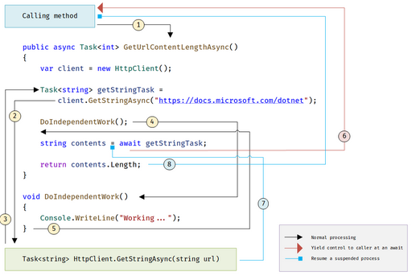

## 1. (2 punts) Cerca un mínim de 5 aplicacions o tecnologies que fan servir programació distribuïda. Explica que fan i per què necessiten ser distribuïdes.

1. Google Search

    **Què fa:** És el motor de cerca més utilitzat del món. Permet als usuaris cercar informació a través de milers de milions de pàgines web.

    **Per què necessita programació distribuïda:** Google fa servir milers de servidors distribuïts arreu del món per emmagatzemar i processar informació. Indexar i buscar a través de tanta informació en temps real només és possible repartint la feina entre moltes màquines que treballen en paral·lel.

2. Netflix

    **Què fa:** Plataforma de streaming que ofereix pel·lícules, sèries i documentals a milions d’usuaris a tot el món.

    **Per què necessita programació distribuïda:** Per oferir contingut en alta qualitat a usuaris de diferents països, Netflix utilitza servidors distribuïts (com els que té a Content Delivery Networks o CDNs). Això permet reduir la latència i assegurar una experiència fluida i ràpida.

3. Bitcoin (Blockchain)

    **Què fa:** És una criptomoneda descentralitzada basada en una tecnologia anomenada blockchain, on les transaccions es registren en una cadena de blocs.

    **Per què necessita programació distribuïda:** El sistema està dissenyat per funcionar sense una autoritat central. Cada node de la xarxa participa en la validació de transaccions i en la còpia del registre. Aquesta distribució garanteix seguretat, resistència a atacs i transparència.

4. Amazon Web Services (AWS)

    **Què fa:** Ofereix serveis de computació al núvol com emmagatzematge, bases de dades, potència de càlcul, etc.

    **Per què necessita programació distribuïda:** Per poder escalar i oferir serveis a milions d’usuaris amb alta disponibilitat i rendiment, AWS utilitza un sistema de servidors distribuïts globalment. Això permet gestionar grans volums de dades i respondre ràpidament a qualsevol sol·licitud.

5. Apache Hadoop

    **Què fa:** És un framework que permet el processament de grans quantitats de dades (big data) de forma distribuïda en un clúster de computadors.

    **Per què necessita programació distribuïda:** Hadoop divideix les dades i el processament entre diferents nodes. Això fa que sigui possible analitzar petabytes d'informació d’una manera eficient i escalable.

## 2. (2 punts) Explica de quines formes s’aplica la concurrència en les CPU’s de més d’un nucli actualment. Raona quins són els avantatges d’aplicar cada tipus.

### Multifil (Multithreading)

**Què és:** Cada nucli pot executar diversos fils (threads) d’un mateix procés. Per exemple, un nucli pot gestionar dos fils alternant-los ràpidament.

**Aplicació:** Amb tecnologies com Simultaneous Multithreading (SMT) o Hyper-Threading (Intel), un sol nucli pot simular dos fils executant-se en paral·lel.

   **Avantatges:**
   
 - Millor aprofitament del nucli quan un fil està esperant (per ex., lectura de memòria).

- Millora el rendiment en aplicacions amb tasques lleugeres i paral·leles.
        
### Multiprocés (Multiprocessing)

   **Què és:** Diversos nuclis executen processos diferents alhora. Cada procés pot ser una aplicació independent.

   **Aplicació:** El sistema operatiu reparteix processos entre nuclis per repartir la càrrega de treball.

   **Avantatges:**

- Millor rendiment global del sistema, especialment quan hi ha moltes aplicacions obertes.

- Aïllament de processos: si un falla, els altres poden continuar funcionant.

### Execució paral·lela (Parallel Execution)

   **Què és:** Una sola aplicació divideix el seu treball en parts que poden ser executades simultàniament per diferents nuclis.

   **Aplicació:** Usada en aplicacions de càlcul intensiu, com simulacions científiques, edició de vídeo o videojocs.

   **Avantatges:**

- Reducció dràstica del temps d'execució.

- Millora d’escalabilitat en sistemes amb molts nuclis.

### Concurrència basada en esdeveniments (Event-driven concurrency)

   **Què és:** Les aplicacions responen a esdeveniments (com entrades de l’usuari o respostes de xarxa) i poden usar fils lleugers per gestionar moltes connexions de forma concurrent.

   **Aplicació:** Servidors web com Node.js o sistemes de xarxa com Nginx.

   **Avantatges:**
   
- Gestió eficient de moltes tasques I/O simultànies amb pocs fils.

- Reducció de consum de memòria comparat amb la creació massiva de fils.

### Programació concurrent amb tasques (Task-based concurrency)

**Què és:** El programador defineix "tasques" (petites unitats de treball) que el sistema pot executar en qualsevol nucli disponible.

   **Aplicació:** Llibreries modernes com Intel TBB, OpenMP o frameworks com async/await en molts llenguatges.

   **Avantatges:**

- Programació més senzilla i abstracta.

- Millor repartiment de càrrega, ja que el sistema pot planificar les tasques dinàmicament.

## 3. (4 punts) Pel que fa a programació paral·lela i programació asíncrona:
   
### a. Enumera i explica les diferències entre elles.

| Aspecte | Programació Paral·lela | Programació Asíncrona |
|----------|----------|----------|
| Objectiu principal    | Executar diverses tasques alhora (simultàniament).   | Gestionar tasques no blocants que triguen, com I/O o xarxa.  |
| Tipus de tasques    | Tasques que es poden dividir i executar en paral·lel.   | Tasques que poden esperar una resposta, com llegir un fitxer.   |
| Execució real en simultani   | Sí (en diversos nuclis de CPU o fils alhora).   | No necessàriament; sovint és un fil únic que canvia de tasca.   |
| Ús típic    | 	Càlculs intensius, simulacions, gràfics, ciència, etc.   | Apps web, interfícies, servidors que gestionen moltes peticions.   |
| Exemples de tecnologies    | 	OpenMP, MPI, CUDA, multiprocessing (Python), threading.  | async/await (Python, JavaScript), callbacks, promeses.   |
| Gestió de recursos    | 	Requereix diversos fils o processos i més memòria.   | Molt eficient: sovint només un fil o molt pocs.   |
| Complexitat de sincronització    | Alta: cal sincronitzar dades compartides.   | Baixa: menys accés simultani a memòria compartida.   |
| Bloqueig del programa    | 	Pot bloquejar si no es gestiona bé la sincronització.   | Evita bloquejos: les tasques dormen i es reprenen automàticament.   |

### b. Explica cada pas del cicle de vida d’aquest mètode asíncron:



- **1. El mètode GetUrlContentLengthAsync() és cridat**

    El mètode es crida des d’un altre punt del programa.

    Com que és async, torna immediatament un objecte Task<int>, indicant que el resultat estarà disponible més endavant.

- **2. S'inicia la crida HTTP asíncrona**

    Es crea un HttpClient.

    Es fa una crida a client.GetStringAsync(...), que torna un Task<string>.

    Aquesta crida no bloqueja, sinó que retorna una tasca que s’executarà en segon pla.

- **3. El control retorna al mètode que ha fet la crida**

    La funció GetUrlContentLengthAsync() cedeix el control (sense esperar) i torna un Task pendent.

    Això permet que el fil que l’ha cridat segueixi fent altres coses.

- **4. Es continua amb treball independent**

    El mètode fa una crida a DoIndependentWork(), que escriu "Working ..." a consola.

    Aquest treball es fa mentre es continua esperant la resposta HTTP.

- **5. El mètode DoIndependentWork() s’executa**

    Imprimeix un missatge i retorna.

    No afecta la tasca asíncrona principal; simplement aprofita el temps d'espera.

- **6. Quan la crida HTTP acaba, es reprèn el mètode suspès**

    Quan getStringTask acaba (és a dir, la resposta HTTP ha arribat), l’execució del mètode es reprèn automàticament on s’havia suspès (després del await).

- **7. Es llegeix el contingut retornat per la crida HTTP**

    Ara que getStringTask ha acabat, await getStringTask retorna el contingut com a string contents.

- **8. Es retorna la longitud del contingut**

    Es calcula contents.Length i es retorna com a resultat de la tasca Task<int>.

### c. De la següent llista d’aplicacions digues quines faries servir únicament programació paral·lela i quina programació asíncrona. Raona la teva resposta:

- #### Processament de lots d’imatges: aplicació que ha de processar una quantitat X d’imatges el més eficientment possible.

**Programació paral·lela**

**Per què?** Cada imatge es pot processar de forma independent i simultània. Dividir la feina entre diversos nuclis o processos accelera molt el rendiment.

**Exemple:** Si tens 100 imatges i 8 nuclis, pots processar-ne 8 alhora.

**Tecnologies típiques:** parallel for, multiprocessing, OpenMP, GPU.
  
- #### Aplicació d’escriptori per a usuaris: aplicació amb una UI que ha de ser fluida.

**Programació asíncrona**

**Per què?** L’objectiu és mantenir la interfície d’usuari fluida, sense bloquejos quan es fan accions com llegir fitxers o accedir a la xarxa. L’asíncronia permet que aquestes operacions es facin sense congelar la UI.

**Tecnologies típiques:** async/await, callbacks, Task.Run.
  
- #### Aplicació de missatgeria en temps real.

**Programació asíncrona**

**Per què?** Les accions com enviar i rebre missatges, accedir a la xarxa, o esperar esdeveniments es poden fer de manera no blocant. L’asíncronia permet atendre moltes connexions alhora amb molt pocs recursos.

**Tecnologies típiques:** sockets asíncrons, websockets (async IO), select/epoll.

- #### Renderització de gràfics en 3d: es renderitza blocs petits de la imatge i s’ajunten en una sola.

**Programació paral·lela**

**Per què?** La renderització de cada bloc o fragment de la imatge pot fer-se en paral·lel. És una tasca intensiva en càlcul i es beneficia molt de dividir-se entre múltiples nuclis o GPU.

**Tecnologies típiques:** CUDA, OpenCL, shaders, paral·lelisme en GPU/CPU.

## 4. (4 punts) Implementa un programa que llista tots els programes que s’estan executant en el teu Sistema Operatiu, mostra els fils que fa servir amb els seus ID’s. Guarda-ho en un arxiu de text (txt) i seguidament guarda el recompte total de processos oberts i del total de fils.

[GitHubEx4](https://github.com/EudaldFajula/t2-processos-2-convocatoria/blob/main/Exercici4/Program.cs)

## 5. (12 punts) Una bateria auxiliar d’una capacitat d’energia M mil·liamperes, pot carregar un dispositiu al mateix temps. El dia del tall de llum es va fer servir fins a quedar-se sense buida. Implementa un programa que segons els dispositius que ha de carregar ens digui el temps que triga a buidar-se i quantes càrregues ha realitzat. Donem per fet que el temps de càrrega és immediat. Un dispositiu té un total N mil·liamperes que extreu de la bateria auxiliar i una velocitat de consum per X mil·liamperes per segon. Tots els dispositius i la bateria auxiliar comencen carregats al 100%.
### Requisits del programa:
- És requisit indispensable l’ús de THREADS i LOCK. Si es cau es pot fer servir, també, la classe MONITOR.
- Per realitzar les mesures de temps s’ha de fer servir la classe STOPWATCH.
- Programar seguint les directrius de Clean Code i crear les classes adient seguint la Programació Orientada a Objectes.
- Un mateix dispositiu pot carregar diverses vegades de la bateria auxiliar.
- En el moment que no hi ha bateria, cap dispositiu pot carregar-se.
- La simulació finalitza quan la bateria no pot omplir al 100% un dispositiu. Tots els threads hauran de parar en aquell moment.
### Realitza la simulació pels següents dos escenaris:

- Per una bateria auxiliar amb capacitat de 100000 mil·liamperes

| Dispositiu | Capacitat bateria (N) | Consum per segon (X) |
|------------|-----------------------|----------------------|
| 1 | 30000 | 10000 |
| 2 | 20000 | 12000 |
| 3 | 5000 | 1000 |

- Per una bateria auxiliar amb capacitat de 100000 mil·liamperes

| Dispositiu | Capacitat bateria (N) | Consum per segon (X) |
|------------|-----------------------|----------------------|
| 1 | 25000 | 23000 |
| 2 | 20000 | 12000 |
| 3 | 8000 | 1000 |
| 4 | 10000 |1000 |

[GitHubEx5](https://github.com/EudaldFajula/t2-processos-2-convocatoria/blob/main/Exercici5/Program.cs)

[Classe Device](https://github.com/EudaldFajula/t2-processos-2-convocatoria/blob/main/Exercici5/Device.cs)

[Classe AuxiliaryBatery](https://github.com/EudaldFajula/t2-processos-2-convocatoria/blob/main/Exercici5/AuxiliaryBattery.cs)

## 6. (12 punts) El fill del pastisser ha entrat a treballar al negoci. Ha vist com funciona la producció i veu que té molt marge de millora en el que fa el temps de produir un sol pastís. El seu pare no ho veu clar, ell sempre treballa de forma seqüencial, fins que no acaba una tasca no comença l’altre. El fill, en canvi, creu que hi ha passos de la recepta que es poden fer en paral·lel.  Realitza dues simulacions i mesura el temps de producció de cada una d’elles seguint els següent quadre de tasques:

### Ingredients, temps i dependències
| Tasques | Descripció | Temps (s) | Depèn de… |
|---------|------------|-----------|-----------|
| 1. Batre la massa | Barrejar farina, ous, sucre i mantega. | 8 | — |
| 2. Pre‐escalfar forn | Arrencar el forn i arribar a 180 °C. | 10 | — |
| 3. Enfornar | Coure la massa dins el forn. | 15 | 1 i 2 han d’haver acabat. |
| 4. Preparar cobertura | Fondre xocolata i llet (ganache). | 5 | Es pot fer paral·lel al forn, però cal que acabi abans de glassejar. |
| 5. Refredar base | Deixar el bescuit a temperatura ambient. | 4 | 3 (enfornar) |
| 6. Glassejar | Cobrir el pastís amb el ganache de xocolata. | 3 | 4 i 5 |
| 7. Decorar | Afegir espelmes i fruits. | 2 | 6 |


### Requisits del programa:
- Implementar cada simulació en un mètode diferent. El programa executarà una després de l’altre i comparà els temps totals.
- Per a la simulació en paral·lel utilitzar la classe TASK. 
- La mesura de temps s’ha d’utilitzar la classe StopWatch.
- La programació ha de seguir la guia de Clean Code i extracció de codi óptims.

[GitHubEx6](https://github.com/EudaldFajula/t2-processos-2-convocatoria/blob/main/Exercici6/Program.cs)

## 7. (4 punts) Analitza el següent codi, explica que pretén fer i determina si té errors o punts de millora per un ús correcte dels Threads. Enumera i explica els erros i les millores trobades. Reescriu el codi de forma correcte
```
using System;

namespace SensorRace
{
    class Program
    {
        public static int[] Readings;

        public static int GlobalMax = int.MinValue;
        public static int GlobalMin = int.MaxValue;

        static void Main(string[] args)
        {
            Console.Write("Introdueix el nombre de sensors: ");
            int sensors = int.Parse(Console.ReadLine());
            StopWatch sW = new Stopwacth();

            Readings = new int[sensors];
            Thread[] threads = new Thread[sensors];

            Random rng = new Random();

            for (int i = 0; i < sensors; i++){
                int id = i;

                threads[i] = new Thread(() =>
                {
                    for (int j = 0; j < 100000; j++){
                        int value = rng.Next(-20, 51);
                        sW.StarNew();

                        Readings[id] = value;

                        if (value > GlobalMax)
                            GlobalMax = value;

                        if (value < GlobalMin)
                            GlobalMin = value;
                    }
                });

                threads[i].Start();
            }
            Console.WriteLine($"Final – Max: {GlobalMax}, Min: {GlobalMin}");
            Console.WriteLine($"Total Process time: {sW.Restart()}");
        }
    }
}
```
### Errors i punts de millora

- **Condicions de carrera en GlobalMax i GlobalMin**

Els fils modifiquen les variables GlobalMax i GlobalMin sense cap mecanisme de sincronització, fet que pot provocar condicions de carrera. Es recomana l'ús de lock o Interlocked per garantir que aquestes operacions es realitzin de manera segura.

- **Error en la classe StopWatch**

La classe s'ha instanciat incorrectament com a StopWatch sW = new Stopwacth();, on Stopwacth està mal escrit. La classe correcta hauria de ser Stopwatch de System.Diagnostics.

- **Error en el mètode StarNew()**

El mètode StarNew(); no existeix a la classe Stopwatch. Probablement es volia utilitzar Start().

- **Falta de sincronització en la inicialització de Random**

L'ús compartit de Random rng = new Random(); en múltiples fils pot generar problemes. Es recomana utilitzar ThreadLocal<Random> per garantir que cada fil tingui la seva pròpia instància de Random.

- **Falta de join en els fils**

Després d'iniciar els fils, no es fa Join(), la qual cosa significa que el programa pot imprimir els resultats abans que tots els fils hagin finalitzat la seva execució.

### Codi corregit

```
using System;
using System.Diagnostics;
using System.Threading;

namespace SensorRace
{
    class Program
    {
        public static int[] Readings;
        private static int GlobalMax = int.MinValue;
        private static int GlobalMin = int.MaxValue;
        private static object lockObject = new object();

        static void Main(string[] args)
        {
            Console.Write("Introdueix el nombre de sensors: ");
            int sensors = int.Parse(Console.ReadLine());
            Stopwatch sW = new Stopwatch();

            Readings = new int[sensors];
            Thread[] threads = new Thread[sensors];

            ThreadLocal<Random> rng = new ThreadLocal<Random>(() => new Random());

            sW.Start();

            for (int i = 0; i < sensors; i++)
            {
                int id = i;
                threads[i] = new Thread(() =>
                {
                    for (int j = 0; j < 100000; j++)
                    {
                        int value = rng.Value.Next(-20, 51);
                        Readings[id] = value;

                        lock (lockObject)
                        {
                            if (value > GlobalMax)
                                GlobalMax = value;
                            if (value < GlobalMin)
                                GlobalMin = value;
                        }
                    }
                });

                threads[i].Start();
            }

            foreach (Thread thread in threads)
                thread.Join();

            sW.Stop();

            Console.WriteLine($"Final – Max: {GlobalMax}, Min: {GlobalMin}");
            Console.WriteLine($"Total Process time: {sW.ElapsedMilliseconds} ms");
        }
    }
}
```
